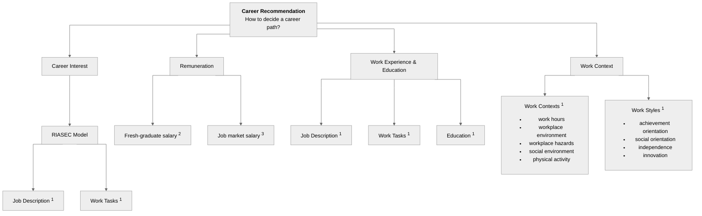
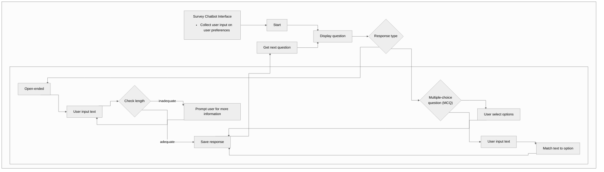
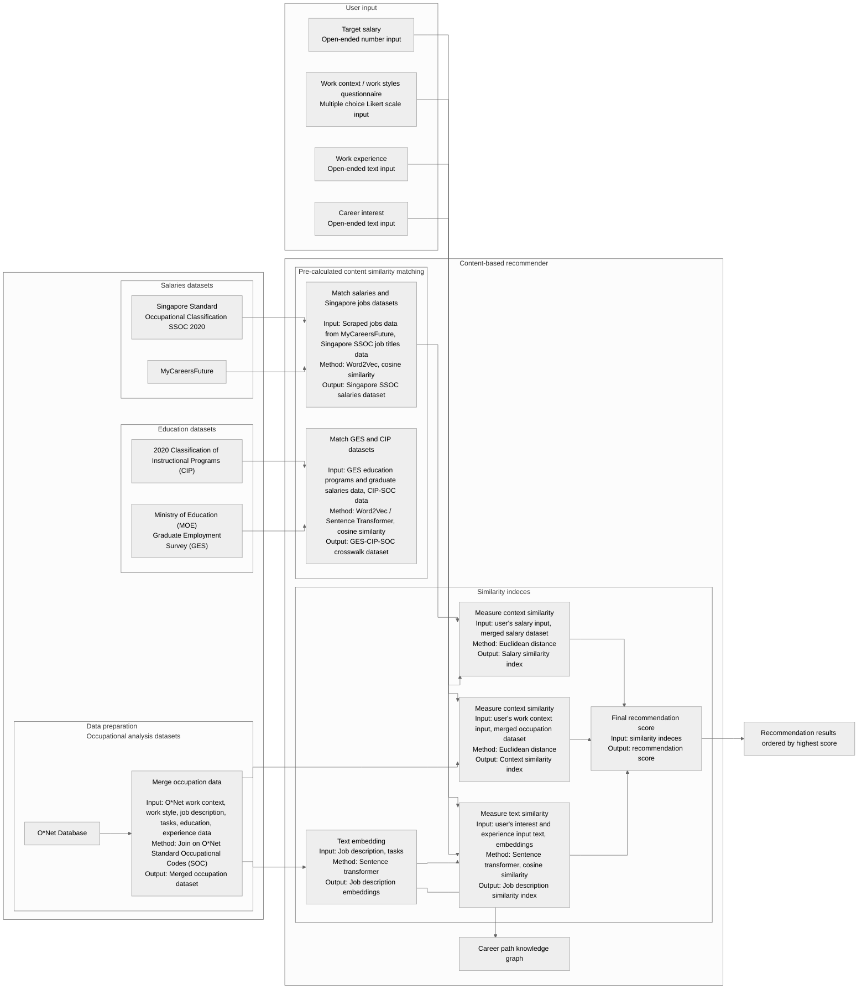

Dependency Diagram for Career Path Recommendation

```mermaid
%%{ init : { "theme" : "neutral", "htmlLabels": true, "flowchart" : { "curve" : "stepAfter" }}}%%

flowchart TD
   recommendation[<b>Career Recommendation</b><br/>How to decide a career path?] --> interest[Career Interest]
   recommendation --> remuneration[Remuneration]
   recommendation --> experience[Work Experience & Education]
   recommendation --> work_context[Work Context]

   %% Factors
   interest --> riasec[RIASEC Model]
   riasec --> job_description_a[Job Description <sup>1</sup>]
   riasec --> work_task_a[Work Tasks <sup>1</sup>]

   remuneration --> fresh_grad_salary[Fresh-graduate salary <sup>2</sup>]
   remuneration --> job_market_salary[Job market salary <sup>3</sup>]

   experience --> job_description_b[Job Description <sup>1</sup>]
   experience --> work_task_b[Work Tasks <sup>1</sup>]
   experience --> education[Education <sup>1</sup>]

   work_context --> work_context_child[Work Contexts <sup>1</sup> <ul><li>work hours</li><li>workplace environment</li><li>workplace hazards</li><li>social environment</li><li>physical activity</li></ul>]

   work_context --> work_styles[Work Styles <sup>1</sup> <ul><li>achievement orientation</li><li>social orientation</li><li>independence</li><li>innovation</li></ul>]
```

Chatbot Process Flowchart

```mermaid
%%{ init : { "theme" : "neutral", "htmlLabels": true, "flowchart" : { "curve" : "stepAfter" }}}%%

flowchart TD
   survey_chatbot[Survey Chatbot Interface<ul><li>Collect user input on user preferences</li></ul>]

   subgraph survey_chatbot_subgraph[" "]
      survey_chatbot --> start
      start[Start] --> display_question[Display question] --> response_type{Response type}
      response_type --> openended[Open-ended]
      response_type --> mcq{"Multiple-choice</br>question (MCQ)"}

      subgraph question_subgraph[" "]
         mcq --> select_option[User select options]
         mcq --> input_text[User input text] --> match_text_to_option[Match text to option]
         select_option --> save_response[Save response]
         match_text_to_option --> save_response

         openended --> input_text_openended[User input text] --> check_length{Check length}
         check_length --> |adequate|save_response
         check_length --> |inadequate|prompt_text[Prompt user for more information] --> input_text_openended
      end

      save_response --> next_question[Get next question]
      next_question --> display_question
   end
```

Recommender System

```mermaid
%%{ init : { "theme" : "neutral", "htmlLabels": true, "flowchart" : { "curve" : "stepAfter", "messageAlign": "left", "useMaxWidth": true }}}%%

flowchart LR

subgraph data_sources[" "]
   subgraph occupational_analysis_dataset["Data preparation<br/>Occupational analysis datasets"]
      onet["O*Net Database"]

      onet --> merge_occupation_data["Merge occupation data<br/><br/>Input: O*Net work context, work style, job description, tasks, education, experience data<br/>Method: Join on O*Net Standard Occupational Codes (SOC)<br/>Output: Merged occupation dataset"]
   end

   subgraph salaries_dataset["Salaries datasets"]
      mycareersfuture["MyCareersFuture"]
      ssoc["Singapore Standard<br/>Occupational Classification SSOC 2020"]
   end

   subgraph education_dataset["Education datasets"]
      ges["Ministry of Education (MOE)<br/> Graduate Employment Survey (GES)"]
      cip["2020 Classification of Instructional Programs (CIP)"]
   end
end

subgraph user_input["User input"]
   interest["Career interest</br>Open-ended text input"]
   experience["Work experience</br>Open-ended text input"]
   work_context["Work context / work styles questionnaire</br>Multiple choice Likert scale input"]
   target_salary["Target salary</br>Open-ended number input"]
end

subgraph content_based_recommender["Content-based recommender"]
   subgraph precalc_content_similarity["Pre-calculated content similarity matching"]
      mycareersfuture --> match_salaries_dataset["Match salaries and Singapore jobs datasets</br></br>Input: Scraped jobs data from MyCareersFuture, Singapore SSOC job titles data<br/>Method: Word2Vec, cosine similarity</br>Output: Singapore SSOC salaries dataset"]
      ssoc --> match_salaries_dataset

      ges --> match_education_datasets["Match GES and CIP datasets</br></br>Input: GES education programs and graduate salaries data, CIP-SOC data<br/>Method: Word2Vec / Sentence Transformer, cosine similarity</br>Output: GES-CIP-SOC crosswalk dataset"]
      cip --> match_education_datasets
   end

   merge_occupation_data --> text_embedding["Text embedding<br/>Input: Job description, tasks<br/>Method: Sentence transformer<br/>Output: Job description embeddings"] --> career_path["Career path knowledge graph"]

   subgraph similarity_indeces["Similarity indeces"]
      measure_text_similarity["Measure text similarity<br />Input: user's interest and experience input text, embeddings<br/>Method: Sentence transformer, cosine similarity<br/>Output: Job description similarity index"]
      text_embedding --> measure_text_similarity
      interest --> measure_text_similarity
      experience --> measure_text_similarity

      measure_context_similarity["Measure context similarity<br />Input: user's work context input, merged occupation dataset<br/>Method: Euclidean distance<br/>Output: Context similarity index"]
      merge_occupation_data --> measure_context_similarity
      work_context --> measure_context_similarity

      measure_salary_similarity["Measure context similarity<br />Input: user's salary input, merged salary dataset<br/>Method: Euclidean distance<br/>Output: Salary similarity index"]
      target_salary --> measure_salary_similarity
      match_salaries_dataset --> measure_salary_similarity

      final_recommendation_score["Final recommendation score<br/>Input: similarity indeces<br/>Output: recommendation score"]
      measure_text_similarity --> final_recommendation_score
      measure_context_similarity --> final_recommendation_score
      measure_salary_similarity --> final_recommendation_score
   end


end
final_recommendation_score --> recommendation["Recommendation results ordered by highest score"]
```
